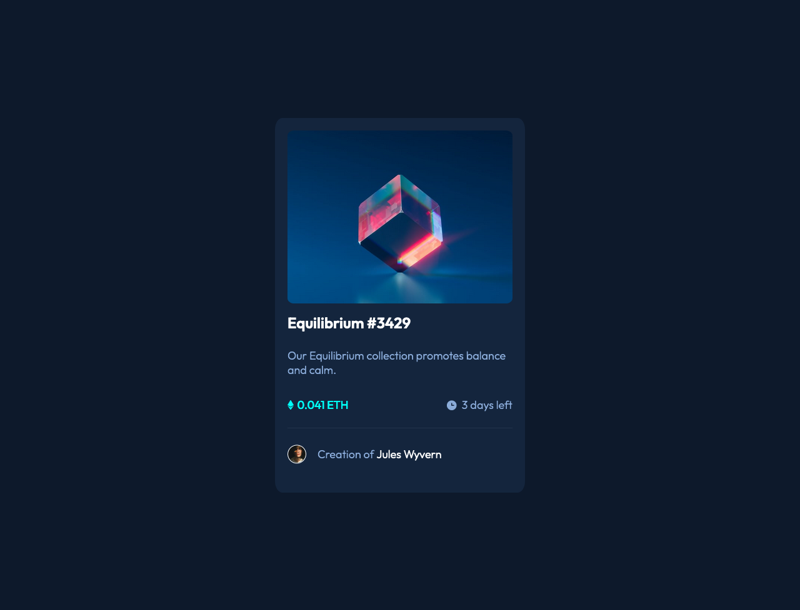

# Frontend Mentor - NFT preview card component solution

This is a solution to the [NFT preview card component challenge on Frontend Mentor](https://www.frontendmentor.io/challenges/nft-preview-card-component-SbdUL_w0U). Frontend Mentor challenges help you improve your coding skills by building realistic projects. 

## Table of contents

- [Overview](#overview)
  - [The challenge](#the-challenge)
  - [Screenshot](#screenshot)
- [My process](#my-process)
  - [Built with](#built-with)
  - [What I learned](#what-i-learned)


## Overview

### The challenge

Users should be able to:

- View the optimal layout depending on their device's screen size
- See hover states for interactive elements

### Screenshot




## My process

### Built with

- Semantic HTML5 markup
- CSS custom properties
- Flexbox

### What I learned

Using `font-family`, `box-model` and `layout`. 

```html
 <div class="container">...</div>
```
```css
.container {
  background-color: hsl(216, 50%, 16%);
  display: flex;
  flex-direction: column;
  gap: 3%;
  padding: 20px;
  width: 400px;
  max-width: 400px;
  min-width: 321px;
  height: 600px;
  border-radius: 3%;
}
```